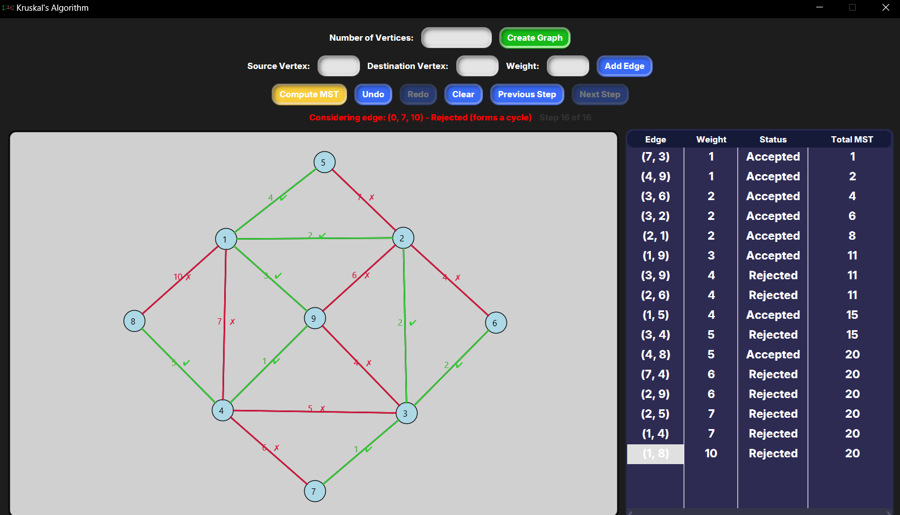

# Kruskal's Algorithm for Weighted Graph
A project for the Design and Analysis of Algorithms, which implements Kruskal’s Algorithm for making an MST(Minimum Spanning Tree) from a weighted graph. There are two algorithms to graph an MST: Prim's and Kruskal's. Our block was given Kruskal’s to make an application out of.

###📎What to know?
I made this alongside Grok, an AI chatbot. I had help with the implementation of edges, vertices, and Kruskal’s algorithm to make the MST.

### 💼 Dependencies
Ensure that JavaFX is properly set up in your IDE or build system to run the app within your IDE of choice. [You can download JavaFX here!](https://openjfx.io)
To run the executable file, the application relies on JDK 24. If you don’t have it, you can download it from [here](https://www.oracle.com/ph/java/technologies/downloads/)

### 📷 Screenshot

